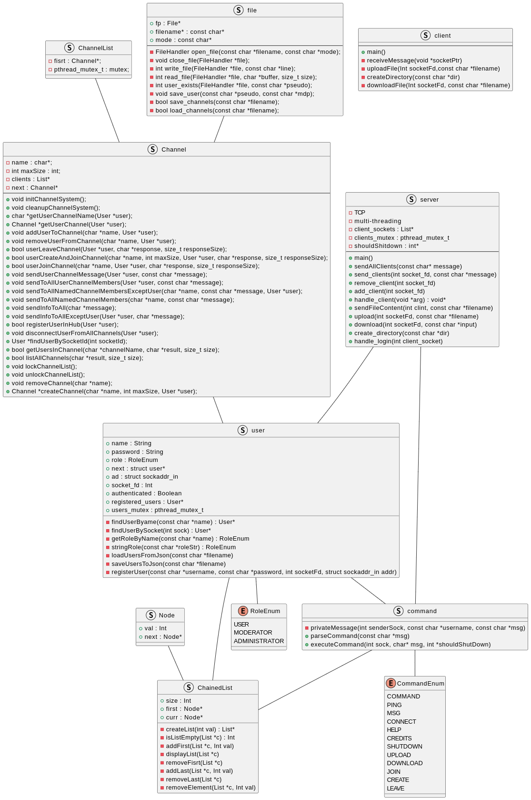
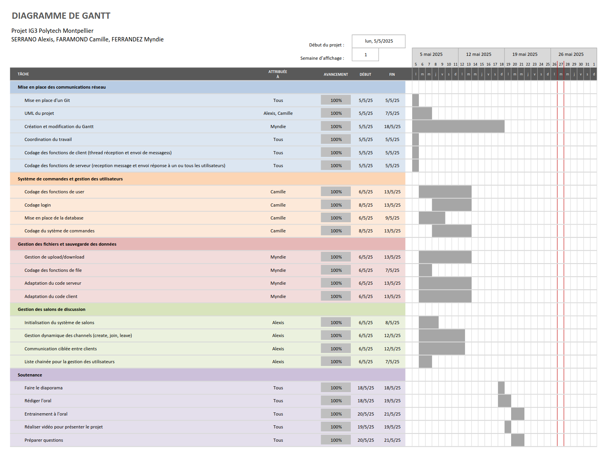

# FAR IG3 Project: Messaging Application

<div align="center">

**🌍 Language / Langue**

[](README.md)
[](README.en.md)

---

</div>

## Introduction
This project was developed as part of the FAR module by a group of 3 students. It is a multi-user online messaging application with authentication, discussion rooms, file transfer, custom commands, and management via a central server.

## Features
- Client-server connections via TCP
- Multi-client management (multithreading)
- User authentication with roles (USER / ADMIN)
- Interactive commands (@connect, @msg, @shutdown, etc.)
- File transfer (`@upload`, `@download`)
- Dynamic discussion room system
- Persistent user backup (`users.json`)
- Help commands and credits via file reading (`README.txt`, `Credits.txt`)

## How it works

- **Server**:
  - Manages multiple clients in parallel via a dedicated thread per connection.
  - Maintains a linked list of connected users.
  - Interprets client commands and responds accordingly.
  - Allows sending/receiving files.

- **Client**:
  - Input and sending of messages/commands via terminal.
  - Real-time reception via secondary thread.
  - Simple but interactive text interface.

## Available commands (client)

| Command                      | Description                                      |
|------------------------------|--------------------------------------------------|
| `@connect <username> <pwd>`  | Login with username and password                 |
| `@msg <username> <message>`  | Send a private message                           |
| `@upload <file>`             | Send a file to the server                        |
| `@download <file>`           | Download a file from the server                  |
| `@create <room> [max]`       | Create a room with a max number of members       |
| `@join <room>`               | Join a room                                      |
| `@leave`                     | Leave a room                                     |
| `@shutdown`                  | Shutdown the server (admin only)                 |
| `@help`                      | List of commands                                 |
| `@credits`                   | Display credits                                  |

## Technologies used
- **Language**: C
- **Network protocol**: TCP (Sockets)
- **Concurrency management**: POSIX Threads (`pthread`)
- **Backup**: TXT
- **Memory organization**: Custom linked list
- **Version control tools**: GitHub

## UML Diagram


## Sequence Diagram


## Planning and Work Distribution
To organize ourselves we set up a Gantt chart:


## Future improvements
- Extend room functionalities, for example by adding private rooms or password-protected rooms.
- Add the ability to list available files on the server for download, or to view active rooms.
- Optimize file transfers, especially by sending acknowledgments or handling larger files.
- Improve the message display system to make it more colorful and avoid interrupting user typing when receiving messages.

## Compilation
> Optional: Change addresses:
> - For local: replace inet_addr("10.111.5.108") with INADDR_ANY
> - For online: replace inet_addr("10.111.5.108") with the correct IP

Compile files
```bash
make
```

Launch the server
```bash
./server
```

Launch the client
```bash
./client
```

---

## Authors
FARAMOND Camille <br>
SERRANO Alexis <br>
FERRANDEZ Myndie <br>
