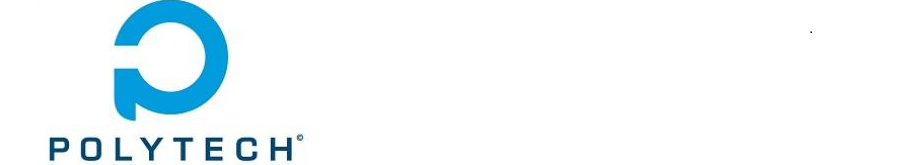
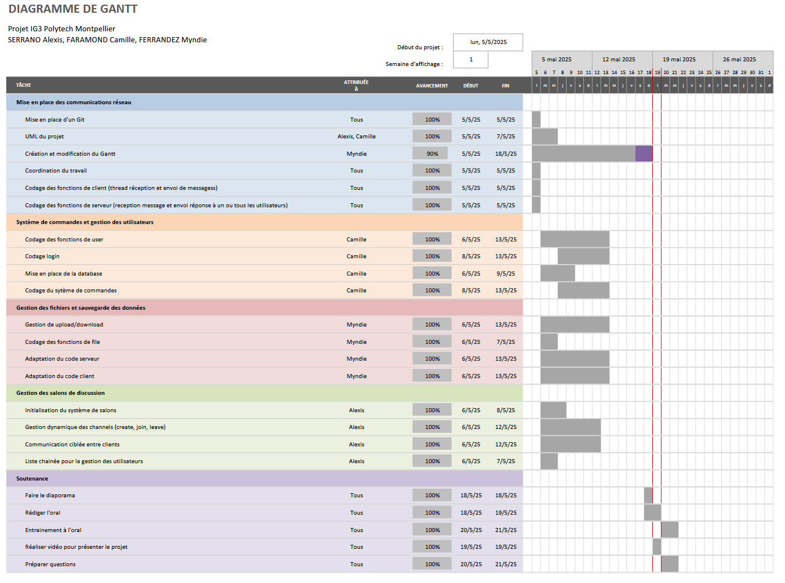

# Projet FAR IG3: Application de messagerie

## Introduction.
Ce projet a été développé dans le cadre du module FAR par un groupe de 3 étudiants. Il s'agit d'une application de messagerie en ligne multi-utilisateurs, avec authentification, salons de discussion, transfert de fichiers, commandes personnalisées, et gestion via un serveur central..<br>

## Fonctionnalités
- Connexions client-serveur via TCP
- Gestion multi-clients (multithreading)
- Authentification des utilisateurs avec rôles (USER / ADMIN)
- Commandes interactives (@connect, @msg, @shutdown, etc.)
- Transfert de fichiers (`@upload`, `@download`)
- Système de salons de discussion dynamiques
- Sauvegarde persistante des utilisateurs (`users.json`)
- Commandes d'aide et crédits via lecture de fichiers (`README.txt`, `Credits.txt`)<br>


## Fonctionnement

- **Serveur** :
  - Gère plusieurs clients en parallèle via un thread dédié par connexion.
  - Maintient une liste chaînée des utilisateurs connectés.
  - Interprète les commandes client et répond en conséquence.
  - Permet l’envoi/réception de fichiers.

- **Client** :
  - Saisie et envoi de messages/commandes via terminal.
  - Réception en temps réel via thread secondaire.
  - Interface texte simple mais interactive.<br>


## Commandes disponibles (client)

| Commande                      | Description                                       |
|------------------------------|---------------------------------------------------|
| `@connect <pseudo> <mdp>`    | Connexion avec pseudo et mot de passe             |
| `@msg <pseudo> <message>`    | Envoyer un message privé                          |
| `@upload <fichier>`          | Envoyer un fichier au serveur                     |
| `@download <fichier>`        | Télécharger un fichier du serveur                 |
| `@create <salon> [max]`      | Créer un salon avec un nombre max de membres     |
| `@join <salon>`              | Rejoindre un salon                                |
| `@leave`                     | Quitter un salon                                  |
| `@shutdown`                  | Arrêter le serveur (admin uniquement)             |
| `@help`                      | Liste des commandes                               |
| `@credits`                   | Affiche les crédits                               |

  
## Technologies utilisées
- **Langage** : C
- **Protocole réseau** : TCP (Sockets)
- **Gestion de concurrence** : Threads POSIX (`pthread`)
- **Sauvegarde** : JSON (avec `cJSON`)
- **Organisation mémoire** : Liste chaînée personnalisée
- **Outils de gestion de version** : GitHub

## Diagramme UML


## Planning et Répartition du travail
Pour nous organiser nous avons mis en place un Gantt:



## Améliorations futures
- Étendre les fonctionnalités des salons, par exemple en ajoutant des salons privés ou protégés par mot de passe. 
- Ajouter la possibilité de lister les fichiers disponibles sur le serveur pour le téléchargement, ou de visualiser les salons actifs. 
- Optimiser les transferts de fichiers, notamment en envoyant des accusés de réception ou en gérant des fichiers plus volumineux. 
- Améliorer le système d’affichage des messages pour le rendre plus coloré et éviter d'interrompre l'écriture de l'utilisateur lors de la réception des messages. 


## Compilation
```bash
make
```
Lancer le serveur
```bash
./server
```

Lancer le client
```bash
./client
```

## Auteurs
FARAMOND Camille <br>
SERRANO Alexis <br>
FERRANDEZ Myndie <br>
